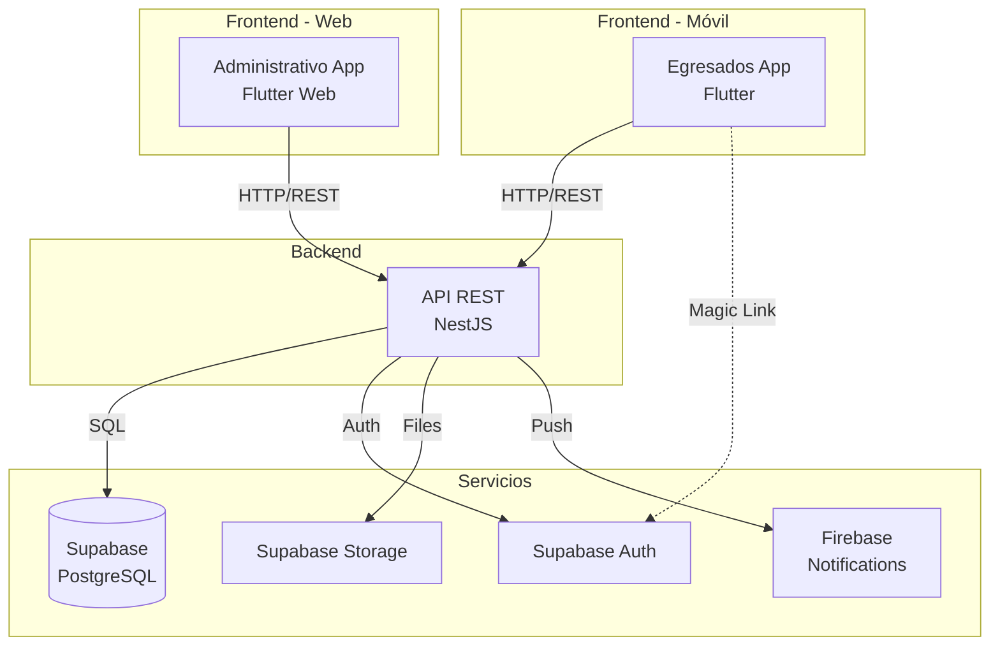

# Sistema de Gestión de Egresados - Universidad Cooperativa de Colombia


Sistema integral para la gestión y seguimiento de egresados de la Universidad Cooperativa de Colombia. El sistema permite a los egresados completar su proceso de graduación mediante la carga de documentos y autoevaluación, mientras que los administradores pueden gestionar el proceso completo desde un panel web.

## Tabla de Contenidos

- [Descripción General](#-descripción-general)
- [Arquitectura del Sistema](#-arquitectura-del-sistema)
- [Componentes del Proyecto](#-componentes-del-proyecto)
- [Stack Tecnológico](#-stack-tecnológico)
- [Testing](#-testing)
- [Instalación y Configuración](#-instalación-y-configuración)
- [Despliegue](#-despliegue)
- [Documentación Adicional](#-documentación-adicional)
- [Autores](#-autores)

## Descripción General

El **Sistema de Gestión de Egresados UCC** es una plataforma completa que digitaliza y optimiza el proceso de seguimiento de egresados de la universidad. El sistema consta de tres componentes principales:

1. **Aplicación Móvil para Egresados** - Permite a los graduados completar su perfil, cargar documentos requeridos y realizar autoevaluaciones
2. **Aplicación Web Administrativa** - Panel de control para administradores que gestiona el proceso completo
3. **Backend/API** - Servidor que centraliza la lógica de negocio y comunicación con la base de datos

### Funcionalidades Principales

#### Para Egresados (App Móvil)
- Autenticación mediante Magic Link (sin contraseña)
- Completar perfil personal y académico
- Carga de documentos requeridos (PDF)
- Sistema de autoevaluación por competencias
- Seguimiento de progreso en tiempo real
- Notificaciones push

#### Para Administradores (App Web)
- Dashboard con estadísticas en tiempo real
- Gestión de egresados (habilitar/deshabilitar)
- Validación de documentos cargados
- Gestión de catálogos (carreras, grados académicos)
- Sistema de autoevaluación configurable
- Generación de reportes y PDFs unificados
- Visualización de estadísticas y gráficas
- Exportación de datos a Excel
- Envío de invitaciones masivas

## Arquitectura del Sistema



### Flujo de Datos

1. **Autenticación**: Egresados usan Magic Link (email) → Supabase Auth
2. **Datos**: Todas las apps → Backend NestJS → Supabase PostgreSQL
3. **Archivos**: Upload de PDFs → Backend → Supabase Storage
4. **Notificaciones**: Backend → Firebase Cloud Messaging → Apps móviles

## Componentes del Proyecto

### Backend (`alumni-backend/`)

**Tecnología:** NestJS + TypeScript   
**Base de datos:** Supabase (PostgreSQL)

#### Estructura
```
alumni-backend/
├── src/
│   ├── auth/              # Autenticación (JWT, Magic Link)
│   ├── egresados/         # Gestión de perfiles de egresados
│   ├── documentos/        # Carga y gestión de documentos PDF
│   ├── autoevaluacion/    # Sistema de autoevaluación
│   ├── admin/             # Funciones administrativas
│   ├── notificaciones/    # Notificaciones push
│   └── database/          # Conexión con Supabase
├── test/                  # Tests E2E y unitarios
└── package.json
```

#### Endpoints Principales
- `POST /auth/admin/login` - Login de administradores
- `POST /auth/magic-link` - Envío de magic link a egresados
- `GET /egresados/me` - Obtener perfil del egresado
- `POST /documentos/upload` - Subir documento
- `GET /autoevaluacion/preguntas` - Obtener preguntas activas

#### Tests
- **20 tests unitarios** pasando al 100%
- Cobertura de auth, egresados, documentos
- Tests E2E con Supertest

**Ejecutar tests:**
```bash
cd alumni-backend
npm test
npm run test:cov  
```

---

### App Móvil de Egresados (`egresados_app/`)

**Tecnología:** Flutter + Dart  
**Plataformas:** Android (APK)
**State Management:** BLoC Pattern

#### Estructura
```
egresados_app/
├── lib/
│   ├── data/
│   │   ├── models/         # Modelos de datos
│   │   ├── services/       # Servicios HTTP (Retrofit)
│   │   └── repositories/   # Repositorios
│   ├── domain/
│   │   └── entities/       # Entidades de negocio
│   ├── presentation/
│   │   ├── blocs/          # BLoCs (Estado)
│   │   ├── screens/        # Pantallas
│   │   └── widgets/        # Widgets reutilizables
│   └── core/
│       ├── config/         # Configuración (Supabase, Firebase)
│       └── utils/          # Utilidades
├── test/                   # Tests unitarios y de widgets
├── integration_test/       # Tests de integración
└── pubspec.yaml
```

#### Pantallas Principales
1. **Onboarding** - Introducción a la app
2. **Login** - Autenticación con magic link
3. **Completar Perfil** - Formulario de datos personales
4. **Home** - Dashboard del egresado
5. **Documentos** - Carga de PDFs requeridos
6. **Autoevaluación** - Cuestionario de competencias
7. **Perfil** - Ver y editar información

#### Tests
- **67 tests** pasando al 100%
- Tests unitarios de servicios, modelos, validadores
- Tests de widgets (UI)
- Tests de integración (flujos completos)

**Ejecutar tests:**
```bash
cd egresados_app
flutter test
```

**Generar APK:**
```bash
flutter build apk --release

```

---

### App Administrativa (`administrativo_app/`)

**Tecnología:** Flutter Web + Dart
**State Management:** Provider

#### Estructura
```
administrativo_app/
├── lib/
│   ├── data/
│   │   ├── models/         # Modelos (User, Egresado)
│   │   └── services/       # Servicios HTTP
│   ├── presentation/
│   │   ├── screens/        # 16+ pantallas administrativas
│   │   ├── widgets/        # Componentes reutilizables
│   │   └── providers/      # Providers (Estado)
│   └── core/
│       ├── config/         # Configuración
│       └── utils/          # Utilidades y validadores
├── test/                   # Tests unitarios
└── pubspec.yaml
```

#### Pantallas Principales
1. **Login** - Autenticación de administradores
2. **Módulos** - Selección de módulo (9 redes)
3. **Dashboard Pre-Alumni** - Estadísticas generales
4. **Lista de Egresados** - Gestión de egresados
5. **Detalle de Egresado** - Ver perfil completo
6. **Documentos** - Validar documentos cargados
7. **Autoevaluación** - Ver respuestas del egresado
8. **Estadísticas** - Gráficas y reportes
9. **Gestión de Preguntas** - Configurar autoevaluación
10. **Gestión de Carreras/Grados** - Catálogos

#### Tests
- **27 tests** pasando al 100%
- Tests de modelos de datos
- Tests de validadores
- Tests de widgets personalizados

**Ejecutar tests:**
```bash
cd administrativo_app
flutter test
```


---

## Stack Tecnológico

### Backend
- **Framework:** NestJS 10.x
- **Lenguaje:** TypeScript 5.x
- **Runtime:** Node.js 20.x
- **Base de Datos:** Supabase PostgreSQL
- **ORM:** Supabase Client
- **Autenticación:** JWT + Supabase Auth
- **Testing:** Jest + Supertest
- **Validación:** class-validator, class-transformer

### Frontend (Ambas Apps)
- **Framework:** Flutter 3.1+
- **Lenguaje:** Dart 3.1+
- **State Management:** BLoC (egresados), Provider (admin)
- **HTTP Client:** Dio + Retrofit
- **Storage:** Flutter Secure Storage
- **Testing:** flutter_test, mockito, mocktail

### Servicios Cloud
- **Base de Datos:** Supabase (PostgreSQL)
- **Autenticación:** Supabase Auth (Magic Link)
- **Storage:** Supabase Storage (PDFs)
- **Notificaciones:** Firebase Cloud Messaging
- **Hosting Backend:** Render / Railway (opcional)
- **Hosting Web:** Firebase Hosting (opcional)

## Testing

### Resumen de Tests

| Componente | Tests | Estado | Cobertura |
|------------|-------|--------|-----------|
| **Backend** | 20 | ✅ 100% | ~70% |
| **App Egresados** | 67 | ✅ 100% | ~80% |
| **App Administrativa** | 27 | ✅ 100% | ~65% |
| **TOTAL** | **114** | ✅ **100%** | **~72%** |


## 🚀 Instalación y Configuración

### Prerrequisitos

- Node.js 20.x o superior
- Flutter SDK 3.1 o superior
- Cuenta de Supabase (gratuita)
- Cuenta de Firebase (opcional, para notificaciones)
- Git

### 1. Clonar el Repositorio

```bash
git clone <url-del-repositorio>
cd "Proyecto de Grado"
```

### 2. Configurar Backend

```bash
cd alumni-backend
npm install

# Crear archivo .env
cp .env.example .env

# Editar .env con tus credenciales de Supabase
SUPABASE_URL=https://tu-proyecto.supabase.co
SUPABASE_KEY=tu-anon-key
JWT_SECRET=tu-secret-jwt
PORT=3000
```

**Ejecutar en desarrollo:**
```bash
npm run start:dev
# API disponible en http://localhost:3000
```

### 3. Configurar App de Egresados

```bash
cd egresados_app
flutter pub get

# Configurar Supabase
# Editar: lib/core/config/supabase_config.dart
```

**Ejecutar en emulador:**
```bash
flutter run
```

### 4. Configurar App Administrativa

```bash
cd administrativo_app
flutter pub get

# Editar configuración en lib/core/config/
```


## Licencia

Este proyecto es privado y pertenece a la Universidad Cooperativa de Colombia.


## Soporte

Para problemas o preguntas:
- Crear un issue en el repositorio
- Contactar al desarrollador principal

## Estado del Proyecto

- Backend completado y testeado
- App móvil de egresados completada y testeada
- App de escritorio administrativa completada y testeada
- Suite de tests completa (114 tests)
- Documentación técnica
- Listo para despliegue


**Última actualización:** Diciembre 2025
