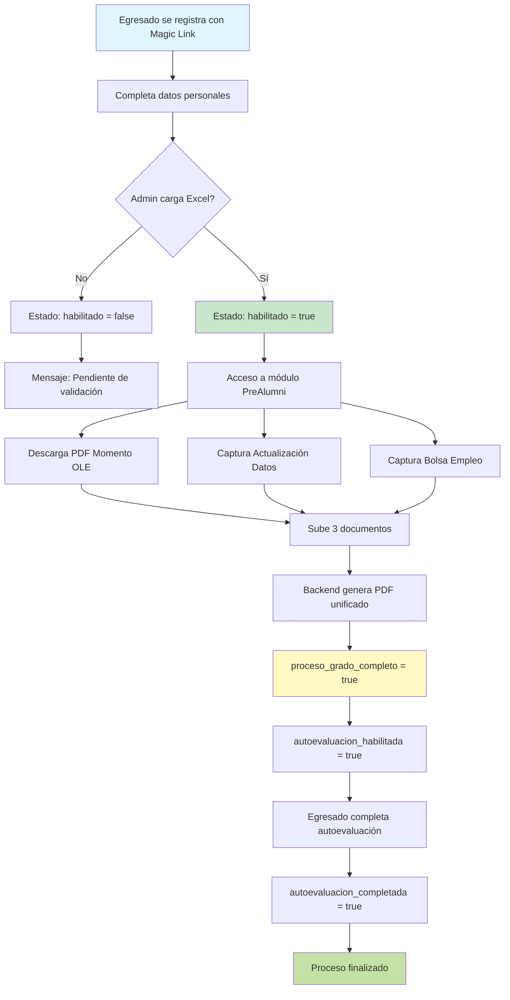
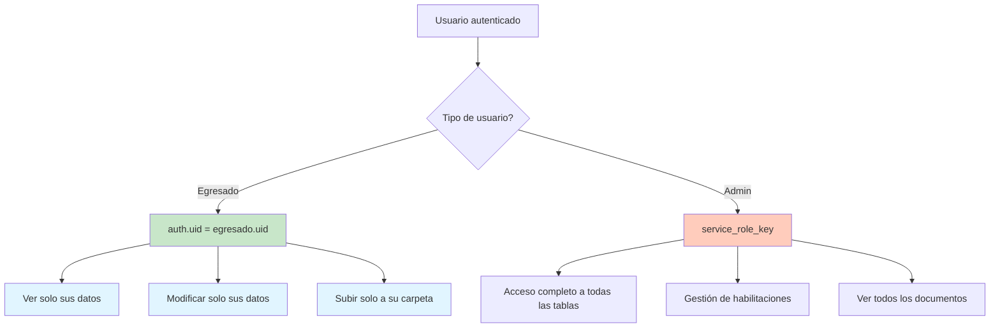
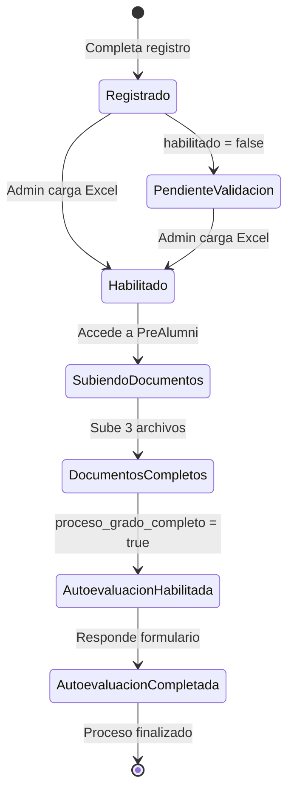

# Diagrama de Relaciones - Base de Datos Alumni

## Diagrama ER (Entidad-Relación)

```mermaid
erDiagram
    carreras ||--o{ egresados : "tiene"
    egresados ||--o{ documentos_egresado : "sube"
    egresados ||--o{ respuestas_autoevaluacion : "responde"
    preguntas_autoevaluacion ||--o{ respuestas_autoevaluacion : "genera"
    administradores ||--o{ cargas_excel : "realiza"
    administradores ||--o{ egresados : "habilita"
    
    carreras {
        uuid id PK
        varchar nombre UK
        varchar codigo UK
        boolean activa
        timestamp created_at
        timestamp updated_at
    }
    
    egresados {
        uuid id PK
        varchar uid UK "Supabase Auth ID"
        varchar correo UK
        varchar nombre
        varchar apellido
        varchar id_universitario
        uuid carrera_id FK
        boolean habilitado
        boolean proceso_grado_completo
        boolean autoevaluacion_habilitada
        boolean autoevaluacion_completada
        timestamp fecha_habilitacion
        uuid habilitado_por FK
        timestamp created_at
        timestamp updated_at
    }
    
    administradores {
        uuid id PK
        varchar correo UK
        varchar nombre
        varchar apellido
        text password_hash
        varchar rol
        boolean activo
        timestamp ultimo_acceso
        timestamp created_at
        timestamp updated_at
    }
    
    documentos_egresado {
        uuid id PK
        uuid egresado_id FK
        varchar tipo_documento
        varchar nombre_archivo
        text ruta_storage
        bigint tamano_bytes
        varchar mime_type
        boolean es_unificado
        timestamp created_at
        timestamp updated_at
    }
    
    preguntas_autoevaluacion {
        uuid id PK
        text texto
        varchar tipo
        jsonb opciones
        integer orden
        varchar categoria
        boolean activa
        timestamp created_at
        timestamp updated_at
    }
    
    respuestas_autoevaluacion {
        uuid id PK
        uuid egresado_id FK
        uuid pregunta_id FK
        text respuesta_texto
        integer respuesta_numerica
        jsonb respuesta_json
        timestamp created_at
        timestamp updated_at
    }
    
    cargas_excel {
        uuid id PK
        uuid admin_id FK
        varchar nombre_archivo
        integer total_registros
        integer registros_procesados
        integer registros_habilitados
        integer registros_errores
        jsonb errores_detalle
        timestamp created_at
    }
    
    modulos {
        uuid id PK
        varchar nombre UK
        text descripcion
        varchar icono
        integer orden
        boolean activo
        text url_info
        timestamp created_at
        timestamp updated_at
    }
    
    logs_sistema {
        uuid id PK
        varchar tipo
        uuid usuario_id
        varchar usuario_tipo
        text accion
        jsonb detalles
        varchar ip_address
        timestamp created_at
    }
```



## Flujo de Datos del Sistema



## Flujo de Documentos en Storage

```mermaid
flowchart LR
    A[Egresado sube documentos] --> B[Storage: egresados-documentos]
    B --> C[Carpeta: /{uid}/]
    
    C --> D[momento_ole.pdf]
    C --> E[datos_egresados.png]
    C --> F[bolsa_empleo.png]
    
    D --> G[Backend NestJS]
    E --> G
    F --> G
    
    G --> H[Genera PDF unificado]
    H --> I[evidencias_completo.pdf]
    I --> C
    
    style A fill:#e3f2fd
    style G fill:#fff3e0
    style I fill:#c8e6c9
```

## Seguridad: Row Level Security (RLS)



## Estados del Egresado



## Tipos de Documentos

| Tipo | Descripción | Formato | Generado por |
|------|-------------|---------|--------------|
| `momento_ole` | Constancia Momento OLE | PDF | Egresado |
| `datos_egresados` | Captura actualización datos | PNG/JPEG | Egresado |
| `bolsa_empleo` | Captura registro bolsa | PNG/JPEG | Egresado |
| `evidencias_completo` | PDF unificado | PDF | Backend |

## Categorías de Preguntas Autoevaluación

| Categoría | Descripción | Tipo de Respuesta |
|-----------|-------------|-------------------|
| `competencias` | Habilidades profesionales | Likert 1-5 |
| `empleabilidad` | Preparación laboral | Likert 1-5 |

## Roles de Administradores

| Rol | Permisos |
|-----|----------|
| `admin` | Gestión básica de egresados |
| `superadmin` | Acceso completo + gestión de preguntas |

---

**Nota**: Todos los diagramas están en formato Mermaid y se renderizan automáticamente en Markdown.
